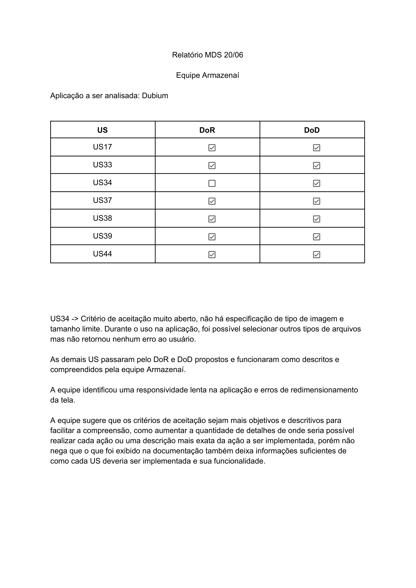

# Estratégia de Testes

## Historico de Revisão

| Data       | Versão | Descrição                       | Autor(es)                                                                  |
| ---------- | ------ | ------------------------------- | -------------------------------------------------------------------------- |
| 13/07/2023 | 0.1    | Definição de estratégia de teste | [Eric](https://github.com/ericbky) e [Yasmim](https://github.com/yaskisoba) |
| 13/07/2023 | 0.2    | Resultados dos testes| [Eric](https://github.com/ericbky) e [Yasmim](https://github.com/yaskisoba) |

|Tipo de teste|Nível de teste|Técnica de teste|Objetivo|Perspectiva|Escopo|
|-----------|-------|----------|----------|--------------|---------|
|Funcional|Unitário|Automático|Qualidade interna|Técnica| MVP1 e MVP2|
|Funcional|Integração|Automático|Qualidade interna|Técnica| MVP1 e MVP2|
|Funcional|Sistema|Caixa Preta|Qualidade externa|Negócio| MVP1 e MVP2|
|Usabilidade|Aceitação|Caixa Preta|Qualidade externa|Negócio|RNF04, RNF06, RNF07|

## Resultados
### Teste Unitário
| US| Critérios de Aceitação| Passou? | Observações|
|---|------------|-------------|-------|

### Teste de Integração
O teste de integração é realizado em todas as branchs logo após um _push_ no repositório. A partir da definição do worflow, foi escrito um arquivo chamado "workflow.yml". Toda vez que um _push_ é realizado aciona o github actions que por sua vez executa alguns jobs: 

### Teste de Sistema
O teste de sistema foi realizado no MVP1 pela equipe Armazenaí e pode ser conferido a seguir:

Já o teste de sistema do MVP2 pode ser observado a seguir:
|US|DOR|DOD|Observações|Conclusão|
|-----------|-----------|------------|------------|---------------|

### Teste de Aceitação
O teste de aceitação foi realizado pela cliente, onde passamos em cada requisito não funcional e ela expôs se estavam de acordo com o solicitado e esperado.

|RNF|Descrição|Conclusão|
|-----------|-----------|------------|

